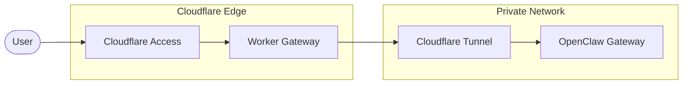

# OpenClaw Workers VPC Gateway

A Cloudflare Worker that provides an authenticated gateway to [OpenClaw](https://docs.openclaw.ai/) running in a private network. It uses Cloudflare Access for authentication and Workers VPC for secure connectivity.

## Features

- **Cloudflare Access Authentication** - Validates JWTs to ensure only authorized users can access the service
- **VPC Service Binding** - Securely connects to OpenClaw running in a private network via Cloudflare Tunnel
- **OpenAI-compatible API** - Exposes `/v1/chat/completions` endpoint for chat completions
- **WebSocket Proxy** - Bridges real-time WebSocket connections between clients and OpenClaw
- **SPA Routing** - Serves the OpenClaw dashboard with proper client-side routing support

## Architecture



## Prerequisites

- [Cloudflare account](https://dash.cloudflare.com/sign-up) with Workers enabled
- [Node.js](https://nodejs.org/) 18+
- [Wrangler CLI](https://developers.cloudflare.com/workers/wrangler/install-and-update/)
- OpenClaw running in a private network (see [OpenClaw docs](https://docs.openclaw.ai/start/getting-started))
- [Cloudflare Tunnel](https://developers.cloudflare.com/cloudflare-one/networks/connectors/cloudflare-tunnel/) configured in your private network

## Quick Start

1. Clone the repository and install dependencies:
   ```bash
   git clone <repository-url>
   cd workers-openclaw-vpc
   npm install
   ```

2. Copy the example environment file and configure your secrets:
   ```bash
   cp .env.example .env
   ```

3. Update `.env` with your Cloudflare Access policy AUD tag:
   ```
   POLICY_AUD=your-access-application-aud-tag
   ```

4. Start the development server:
   ```bash
   npm run dev
   ```

## Configuration

### Environment Variables

| Variable                 | Description                                                                         | Required     |
| ------------------------ | ----------------------------------------------------------------------------------- | ------------ |
| `TEAM_DOMAIN`            | Your Cloudflare Access team domain (e.g., `https://your-team.cloudflareaccess.com`) | Yes          |
| `POLICY_AUD`             | The Application Audience (AUD) tag from your Access application                     | Yes (secret) |
| `OPENCLAW_GATEWAY_TOKEN` | The OpenClaw Gateway Token                                                          | Yes (secret) |

### Wrangler Configuration

The `wrangler.jsonc` file contains the VPC Service binding configuration:

```jsonc
{
  "vpc_services": [
    {
      "binding": "VPC_SERVICE",
      "service_id": "<your-vpc-service-id>",
      "remote": true
    }
  ]
}
```

## Deployment

### 1. Set up Cloudflare Tunnel

Install and configure `cloudflared` in your private network where OpenClaw is running:

```bash
cloudflared tunnel create openclaw-tunnel
cloudflared tunnel route dns openclaw-tunnel openclaw-internal.example.com
```

Configure the tunnel to point to your OpenClaw Gateway (default: `http://localhost:18789`). See the [Tunnel documentation](https://developers.cloudflare.com/cloudflare-one/networks/connectors/cloudflare-tunnel/) for detailed setup.

### 2. Create a VPC Service

Create a VPC Service that connects to your OpenClaw instance:

```bash
npx wrangler vpc service create openclaw-service \
  --type http \
  --tunnel-id <your-tunnel-id> \
  --hostname localhost \
  --http-port 18789
```

Save the returned Service ID for the next step. See [VPC Services documentation](https://developers.cloudflare.com/workers-vpc/configuration/vpc-services/) for more options.

### 3. Configure Cloudflare Access

1. Go to [Cloudflare Zero Trust](https://one.dash.cloudflare.com/) → **Access controls** → **Applications**
2. Select **Add an application** → **Self-hosted**
3. Configure the application domain to match your Worker's URL
4. Create an Access policy to control who can access the application
5. After saving, find the **Application Audience (AUD) Tag** in the application's overview page

See [Cloudflare Access documentation](https://developers.cloudflare.com/cloudflare-one/access-controls/applications/http-apps/) for detailed setup.

### 4. Deploy the Worker

1. Update `wrangler.jsonc` with your VPC Service ID

2. Set the `POLICY_AUD` and `OPENCLAW_GATEWAY_TOKEN` secret:
   ```bash
   npx wrangler secret put POLICY_AUD
   npx wrangler secret put OPENCLAW_GATEWAY_TOKEN
   ```

3. Deploy:
   ```bash
   npm run deploy
   ```

## API Routes

| Route                  | Method | Auth | Description                                                                        |
| ---------------------- | ------ | ---- | ---------------------------------------------------------------------------------- |
| `/v1/chat/completions` | POST   | Yes  | OpenAI-compatible Chat Completions API. Make sure you enable API for your Gateway. |
| `/tools/invoke`        | POST   | Yes  | Tools invocation API                                                               |
| `/`                    | GET    | Yes  | WebSocket proxy; redirects HTTP to `/app`                                          |
| `/app/*`               | GET    | Yes  | SPA routes (OpenClaw dashboard)                                                    |
| `/assets/*`            | GET    | Yes  | Static assets                                                                      |
| `/chat.html`           | GET    | Yes  | Demo chat interface (see below)                                                    |

## Demo Chat Interface

A simple chat interface is included at `/chat.html` for testing the `/v1/chat/completions` API endpoint. This is a standalone HTML file that demonstrates:

- Streaming chat completions with Server-Sent Events (SSE)
- Conversation history management
- Basic error handling

**Note:** The demo uses a hardcoded model name (`MiniMax-M2.1`). If you're using a different model, edit `public/chat.html` and update the `MODEL` constant on line 227.

## Development

```bash
npm run dev          # Start development server
npm run cf-typegen   # Generate TypeScript types
npm run deploy       # Deploy to production
```

## Contributing

Contributions are welcome! Please feel free to submit a Pull Request.

## License

MIT
